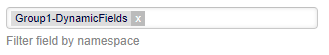
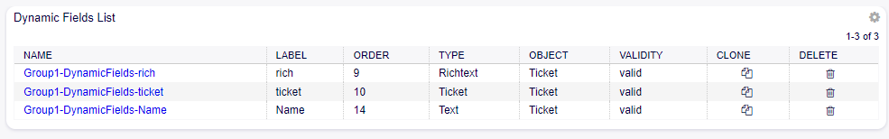
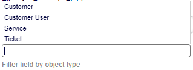
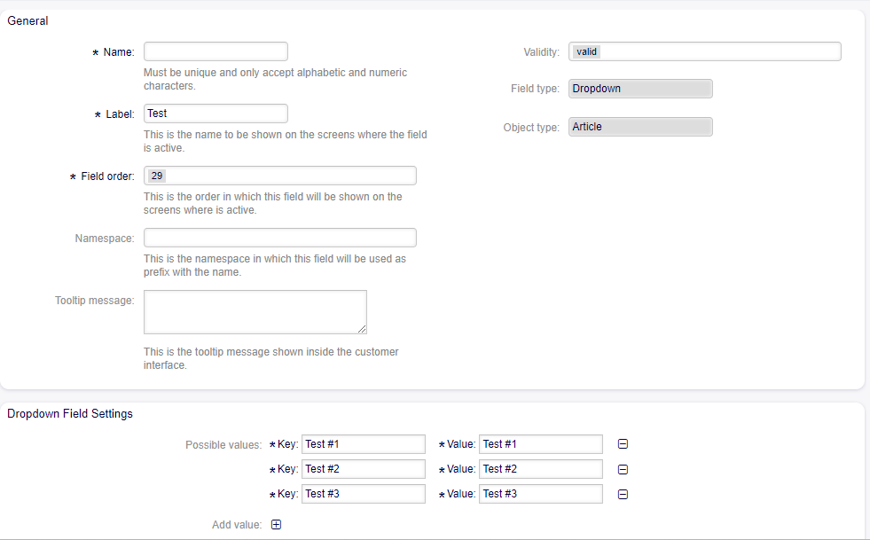

AdminDynamicField
=================

From the dynamic fields module in the filtering widget, fields for filtering are observed:

Filter for Namespaces
------------------------
In this field, the values of Namespaces that have been configured appear, and you can filter by the dynamic fields associated with the selected value.

   

Filter for Object Type
-------------------------
In this filtering field, the value by which the fields will be displayed according to their type is selected.

Cloning of Dynamic Fields
---------------------------
It is now possible to clone the configuration of dynamic fields from the "Clone" column located in the list of fields.

.. figure:: images/CloningDynamicFields.png
    :alt: Dynamic Fields List

Clicking on the icon opens a screen with the same configuration as the selected field.

.. note::
    
It is necessary to create the field with a different name than the previous field.