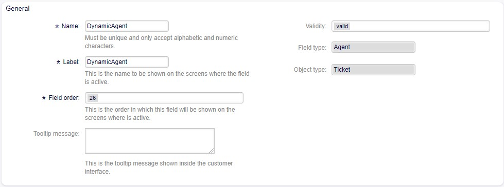
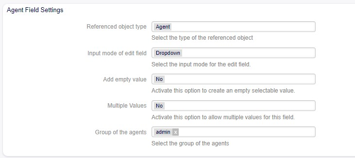
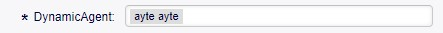

Reference Dynamic Field  -  Agent 
==================================

Allows creating a field that displays created agents.

Field Configuration
------------------------
Standard configuration for all fields is displayed.

   

Field Configuration Reference
------------------------------------

Referenced object type
    Displays the selected reference type.

Input mode of edit field
    Allows selecting the mode in which the field will be used:

    *AutoComplete*

    Autocompletes values as they match the characters used.

    *Dropdown*
.. figure:: Images/Dropdown_1.jpg

    Displays field values as a dropdown type.

.. figure:: Images/Dropdown_2.jpg

    *Multiselect*
.. figure:: Images/Multiselect_1.jpg

    Allows selecting multiple values for the field.

.. figure:: Images/Multiselect_2.jpg  

Add empty value

    Selecting Yes in this option allows the field to be empty.
.. figure:: Images/AddEmptyValue_2.jpg

    Selecting No in this option does not allow the field to be empty.

Group of the Agents
.. figure:: Images/GroupAgents.jpg
    Allows selecting the group of agents to be displayed in the field.
