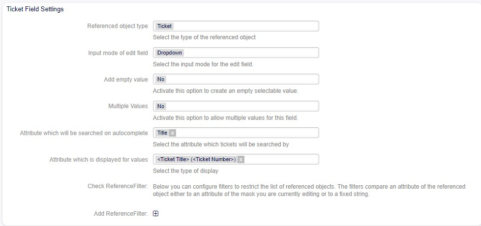
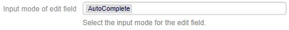
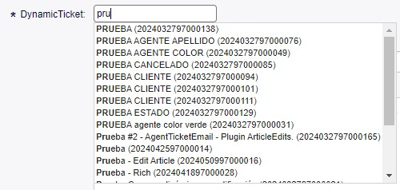
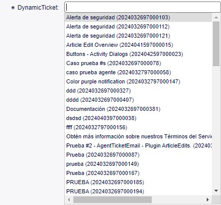
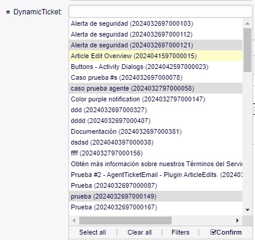
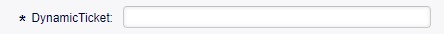
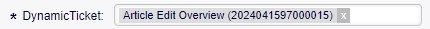
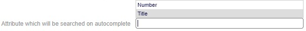
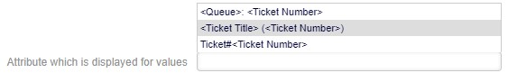
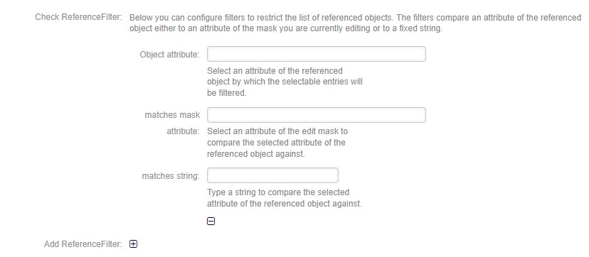

Reference Dynamic Field -  Ticket
==================================
Allows selecting created tickets.

Field Configuration
------------------------

   

Referenced object type
~~~~~~~~~~~~~~~~~~~~~~
    Displays the selected reference type.

Input mode of edit field
~~~~~~~~~~~~~~~~~~~~~~~~
    Allows selecting the mode in which the field will be used:

AutoComplete
~~~~~~~~~~~~

    Autocompletes values as they match the characters used.

Dropdown
~~~~~~~~~
.. figure:: images/Dropdown_1.jpg

    Displays field values as a dropdown type.

Multiselect
~~~~~~~~~~~
.. figure:: images/Multiselect_1.jpg

    Allows selecting multiple values for the field.

Add empty value
~~~~~~~~~~~~~~~
.. figure:: images/AddEmptyValue_1.jpg

    Selecting Yes in this option allows the field to be empty.

    Selecting No in this option does not allow the field to be empty.

Attribute which will be searched on autocomplete
~~~~~~~~~~~~~~~~~~~~~~~~~~~~~~~~~~~~~~~~~~~~~~~~~
    To select which attribute to filter the ticket (Title or Number).

Attribute which will be searched on autocomplete
~~~~~~~~~~~~~~~~~~~~~~~~~~~~~~~~~~~~~~~~~~~~~~~~~
    Allows selecting which values will be displayed in the list.

Check ReferenceFilter
~~~~~~~~~~~~~~~~~~~~~
    It is possible to configure filters to limit the list of tickets displayed in the field.

-
    Object attribute
        Allows selecting a property of the ticket that you want to use to filter the entries displayed in the field.

    Matches mask attribute
        Selects an attribute of the edit mask to compare with the selected attribute of the referenced object. This means that the value of the attribute of the referenced object will be compared with the value of the same attribute in the current edit mask.

    Matches string
        Enter a string of text that will be used as a criterion to determine if there is a match between the value of the attribute of the referenced object and this string you provided.

    Add Reference Filter
        Allows adding more fields (Object attribute - Matches mask attribute - Matches string) for filtering.
