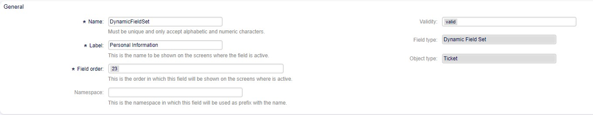
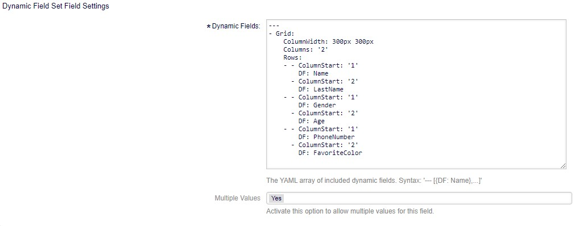
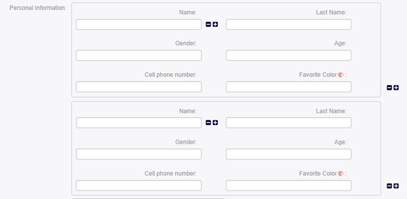

Dynamic Field Set 
=================

This new field allows parametrizing dynamic fields within it and structuring them across rows and columns.

Field Configuration
------------------------
   Standard configuration for all fields is displayed.

   

Configuration
------------------

Dynamic Fields
--------------
This text field is used to parameterize the fields that will be displayed in YAML format.

   Grid
   ~~~~
   It's a variable that defines a container to organize elements in 
   rows and columns.

   Columns
   ~~~~~~~
   Specifies the number of columns in the structure.

   ColumnWidth
   ~~~~~~~~~~~
   Specifies the width of the columns, using pixels in the example.
   
   Rows
   ~~~~
   A list containing the rows of the structure.

   ColumnStart
   ~~~~~~~~~~~
   Indicates which column the data field starts in.

   DF
   ~~
   Represents the dynamic field; the field name should be indicated.

   Mandatory
   ~~~~~~~~~
   Indicates if the dynamic field is mandatory ('1' for yes and '0' for 
   no).

Field Display
--------------
After configuring and publishing the field in a creation form, this is how it appears.

Multiple Values
   Allows using multiple values in the field structure.
